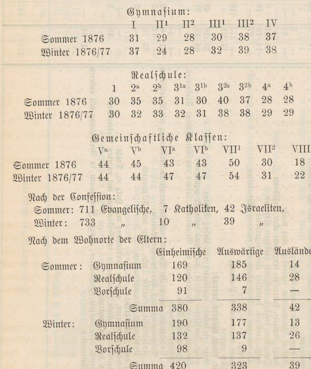

# Sduten. 

Das Röniglide Mndreanum zäblte 1876/77 im Sommer 760, im Winter 782 Sdüter und 32 Lehrer. Die Sdüter bertheilen jid) folgendermajen:

Die (iintheilung der Sdüler nad) Dem Stande der (Eltern ergiebt nad) Dem Beitande vom Monat December 1876 folgendes Rejultat: