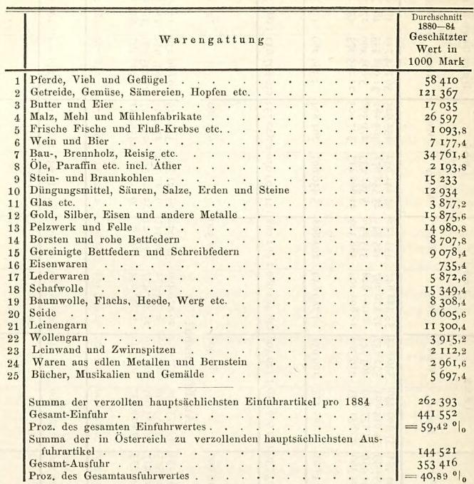

# Einfuhr von Österreich-Ungarn nach Deutschland. 

Die größte Rolle spielen, wie bekannt, bei der Einfuhr von Österreich die Produkte der Land- und Forstwirtschaft etc.

|  |  | Geschätzter Wert. |
| :--: | :--: | :--: |
|  |  | Durchschnitt |
|  | Getreide, Gemüse, Obst, Sämereien, Hopfen | 121367 |
|  | Vieh, Pferde, Geflügel etc. | 58410 |
|  | Butter und Eier | 17035 |
|  | Flachs | 1355 |
|  | Schafwolle | 15349 |
|  | Borsten, rohe Bettfedern | 8708 |
|  | Produkte der Landwirtschaft | 222224 |
|  | Produkte der Forstwirtschaft | 34761 |
|  | Produkte der Fischerei | 1094 |
|  | Summa | 258079 |

das sind $57,8 \frac{0}{0}$ der ganzen Einfuhr.